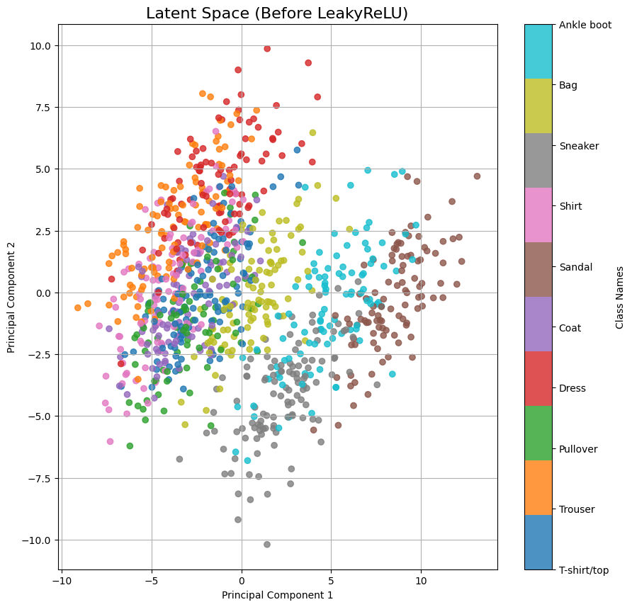
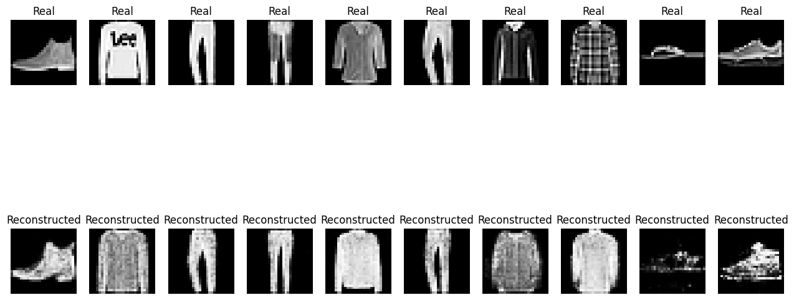
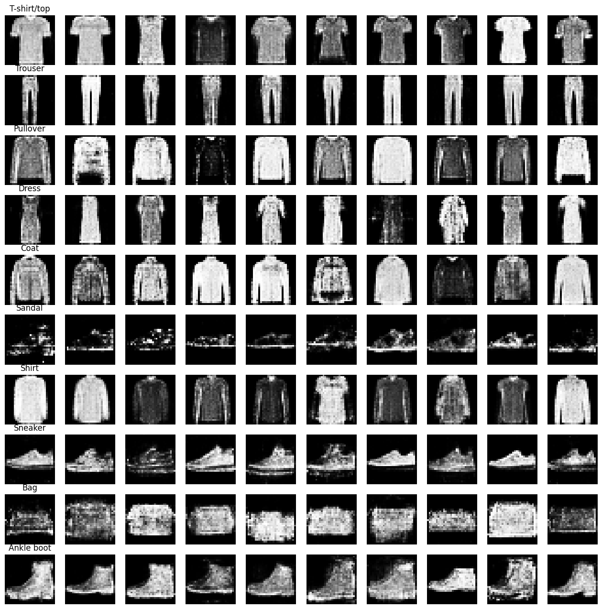

# Results Analysis

## Dataset Exploration

For an in-depth understanding of the dataset, an exploration was conducted. You can find the detailed notebook here:

[Dataset Exploration Notebook](./src/datavize.ipynb)

## Training Challenges

During the training process, I faced numerous challenges in achieving a proper balance between the generator and discriminator. Several hyperparameter configurations were tested, including adjustments to the learning rate, batch size, and dropout probabilities. After extensive experimentation, the best training results were obtained and are visualized in the loss curves:

**Best Training Results:**

>The loss curves show the progression of the generator and discriminator losses over the training epochs, indicating the stability and convergence of the training process.

---

## Interpretation Functions

To facilitate the analysis and interpretation of the results, the following functions were implemented. Each function serves a specific purpose in evaluating and understanding the trained models.

### 1. **`test_discriminator`**
Evaluates the discriminator's performance on real and fake samples and generates pie charts to visualize the accuracy.

- **Outputs:**
    - Overall accuracy pie chart
    - Real sample accuracy pie chart
    - Fake sample accuracy pie chart

**Discriminator Test:**

>The pie charts illustrate the discriminator's accuracy in distinguishing between real and fake samples, providing insights into its performance. We can notice that it struggles more to discriminate among real images than with fake images.

### 2. **`random_interpolate_labels`**
Generates interpolated images between two random labels to visualize transitions in the latent space.

- **Outputs:**
    - Rows of images showing the interpolation process

**Random Interpolate Labels:**

>The interpolated images demonstrate smooth transitions between different labels, showcasing the generator's ability to navigate the latent space. For instance, we can see that between a t-shirt and a dress, there is an intermediate image resembling a coat, indicating the proximity of these items in the latent space. However, the interpolation between a shirt and a coat sometimes leads to a sneaker, which doesn't always make sense, suggesting that the latent space may have some inconsistencies or unexpected mappings.

### 3. **`latent_space_analysis`**
Analyzes and visualizes the latent space representations using PCA, including a general visualization and per-class clustering.

- **Outputs:**
    - PCA plot of latent space representations
    - Individual class visualizations

**Latent Space Analysis:**

>The PCA plot provides a visual representation of the latent space, highlighting the clustering of different classes after applying the ReLU activation. This visualization helps in understanding how well the model separates different classes in the latent space. The distinct clusters indicate that the model has learned meaningful representations for each class.

### 4. **`latent_space_analysis_before_LeakyReLU`**
Similar to `latent_space_analysis`, but focuses on visualizing the latent space before applying the LeakyReLU activation.

- **Outputs:**
    - PCA plot of latent space representations before activation

**Latent Space Analysis Before LeakyReLU:**

>The PCA plot visualizes the high-dimensional data in a two-dimensional space, making it easier to observe patterns and clusters. By comparing the latent space representations before and after the LeakyReLU activation, we can assess how the activation function transforms the data. This comparison helps in understanding the impact of the activation function on the data's structure and separability.

### 5. **`reconstruct_test_data`**
Reconstructs real test images using the generator and compares them side-by-side with the original images.

- **Outputs:**
    - Side-by-side comparison of real and reconstructed images

**Reconstructed Test Data:**

>The side-by-side comparison highlights the generator's ability to reconstruct real images, demonstrating its effectiveness in capturing image details. The reconstructed images closely resemble the original test images, indicating that the generator has learned to preserve essential features. However, some minor discrepancies can be observed, such as slight blurring or loss of fine details. These differences suggest areas for potential improvement in the generator's architecture or training process.

### 6. **`analyze_diversity`**
Analyzes the diversity of generated samples for each class and visualizes them in a grid.

- **Outputs:**
    - Grids of generated images for each class

**Analyze Diversity:**

The grids of generated images showcase the diversity within each class, indicating the generator's capability to produce varied and distinct samples. By examining these grids, we can observe the range of variations the generator can create, such as different styles, shapes, and textures within the same class. This diversity is crucial for ensuring that the generator does not simply memorize the training data but instead learns to generate new, unique samples. However, some classes may exhibit less diversity, suggesting areas where the generator's performance could be further improved.

---